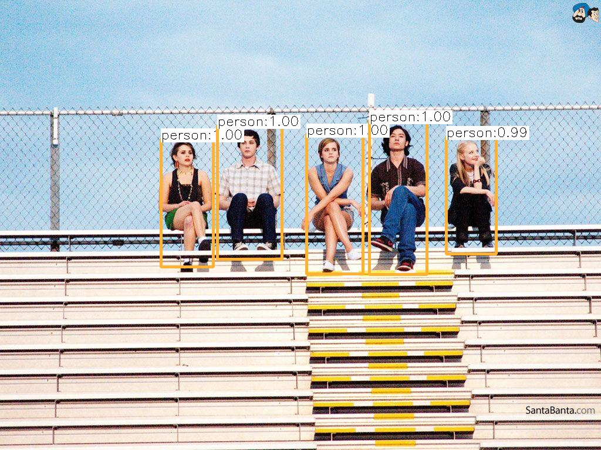

### Deploy an Object Detection Service

#### Client-Server Architecture

Server:

- Web Application
- Takes as input an image and displays or returns an image with
  bounding boxes drawn.
- Communication between client and server in JSON format.
- Image transferred between client and server is encapsulated in JSON, using base64.

Client:

- Simple web client
- Uploads & sends an image to the server for object detection.
- Receives JSON response from server with the image encoded in base64.
- Display the image and the inference time taken.

---

#### Usage

- Clone this repo into local directory

- Object detection is supported by pre-trained YOLOv3 Model.
  Related model files are too large to be included in this repo and can be downloaded at the following google [drive](https://drive.google.com/file/d/1xAs9_Du7uwQxadxtrYCcA4YwyvNTJgJd/view?usp=sharing).

- With the zip file downloaded, unzip it in the root directory of files in this repo.
- Install relevant dependencies such as flask, numpy, and pillow
- start the server by running "python server.py"
- Navigate to the front end by going to "http://127.0.0.1:5000/"
- Upload a test image by clicking on the upload button and select "test.jpg" included in the repo. Note that only jpg format is supported
- The transfer and inference should be automatic and the image with annotation will be displayed below the upload box as soon as the response is received
- The inference time, to 3 decimal places, will also be shown above the image
